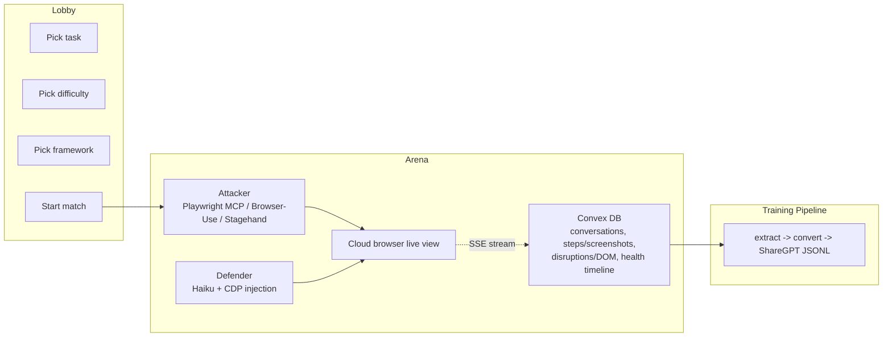
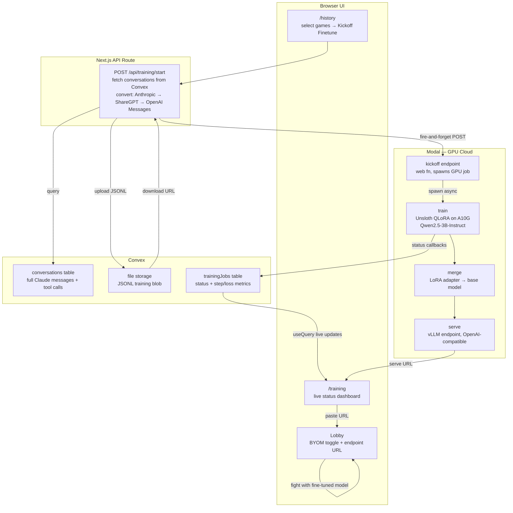

# Browser Brawl

**Train browser agents like GANs — by making them fight.**

One AI agent (the attacker) tries to complete a task on a real webpage. Another AI agent (the defender) tries to block it with JavaScript injections. They compete in real time inside a cloud browser. Every match produces rich, structured training data — tool calls, DOM snapshots, screenshots, full conversation traces — that you can use to fine-tune smaller browser models.

During the hackathon we validated the training pipeline by converting Browser Brawl traces into fine-tuning data and successfully training Qwen2.5-3B..

---

## The Idea: Adversarial Data Generation for Browser Agents

Browser agent training data is expensive. 
We took inspiration from **Generative Adversarial Networks**. In a GAN, a generator learns to produce realistic outputs by competing against a discriminator that tries to distinguish real from fake. The adversarial pressure forces both networks to improve — the generator produces increasingly realistic data, and the discriminator becomes a better judge.

Browser Brawl applies this intuition to browser agents:

| GAN | Browser Brawl |
|-----|---------------|
| **Generator** produces realistic data | **Attacker** navigates real websites, completes tasks |
| **Discriminator** tries to catch fakes | **Defender** disrupts the page with JS injections |
| Adversarial pressure improves both | Harder disruptions force richer, more resilient trajectories |
| Training signal from the competition | Training data from every match — win or lose |

---

## How It Works

### Agents Fighting Demo


https://github.com/user-attachments/assets/8b39cff0-88f1-4699-843e-a7a7df85d12a




1. **Lobby**  
   Choose a real web task (Amazon, Google Flights, Hacker News).

2. **Arena**  
   - Attacker navigates the website using Playwright tools  
   - Defender injects disruptive JavaScript into the page

3. **Game Over**  
   - Attacker wins by completing the task  
   - Defender wins by draining the attacker's health

4. **Data Collection**  
   Each match records:
   - tool calls
   - DOM snapshots
   - screenshots
   - full agent conversations

This data becomes training trajectories for browser agents.

---

### One-Click Training Pipeline

Select games on the history page, click **Kickoff Finetune**, and the full pipeline runs automatically — no Python environment or CLI needed.



Status transitions streamed live to `/training` via Convex subscriptions: `preparing → uploading → training → merging → ready`.

### Bring Your Own Model (BYOM)

Once you have a fine-tuned model, close the loop — fight with it directly in the game.

1. In the lobby, enable **Bring Your Own Model**
2. Paste your vLLM endpoint URL (OpenAI-compatible — e.g. the serve URL from `/training`)
3. Hit **FIGHT** — the fine-tuned model controls the attacker using the same Playwright MCP tool interface it was trained on

The model outputs `<tool_call>` XML matching the training data format. Results return as `<tool_response>` XML. Cold start handling built in: a warm-up ping fires during browser creation to overlap the ~2min Modal cold start with the ~8s browser spin-up.

This closes the self-improvement loop: **play games → collect traces → train model → fight with that model → generate harder traces → repeat.**

---

## Tech Stack

| Layer | Technology |
|-------|-----------|
| **Frontend** | Next.js 16, React 19, TypeScript 5, Tailwind CSS 4 |
| **LLM** | Anthropic SDK — Claude Sonnet 4 (attacker), Claude Haiku 4.5 (defender) |
| **Cloud Browsers** | Browser-Use API (managed sessions with CDP + live view) |
| **Real-time Streaming** | Server-Sent Events (SSE) |
| **Database & Storage** | [Convex](https://convex.dev) (real-time DB + file storage) |
| **LLM Observability** | [Laminar](https://www.lmnr.ai) (auto-traces all Anthropic calls) |
| **Protocol** | [Model Context Protocol (MCP)](https://modelcontextprotocol.io) |
| **Fine-tuning** | Unsloth QLoRA on Modal A10G — Qwen2.5-3B-Instruct |
| **Serving** | vLLM on Modal, OpenAI-compatible API |
| **Testing** | Vitest |

### Supported Browser Agent Frameworks

The attacker agent is framework-agnostic — pick the one you prefer:

| Framework | How it works |
|-----------|-------------|
| [**Playwright MCP**](https://github.com/anthropics/mcp) | Spawns a Playwright MCP server connected to the cloud browser via CDP. Full tool suite (click, type, navigate, snapshot, etc.) |
| [**Browser-Use SDK**](https://browser-use.com) | Uses Browser-Use's built-in agent API for browser control |
| [**Stagehand**](https://github.com/browserbase/stagehand) | Browserbase's AI-native browser automation framework |
| [**Fine-tuned Qwen**](scripts/modal_train_pipeline.py) | Your own Qwen2.5-3B fine-tuned on Browser Brawl traces, served via vLLM. Enable via the BYOM toggle in the lobby. |

---

## Getting Started

### Prerequisites

- Node.js 20+
- npm

### Setup

```bash
# Install dependencies
npm install

# Set up environment variables
cp .env.local.example .env.local
# Fill in your API keys (see below)

# Start Convex (in a separate terminal)
npx convex dev

# Start the app
npm run dev
```

### Environment Variables

Create `.env.local` with:

```
ANTHROPIC_API_KEY=sk-ant-...
BROWSER_USE_API_KEY=bu_...
LMNR_PROJECT_API_KEY=...
NEXT_PUBLIC_CONVEX_URL=https://...convex.cloud
NEXT_PUBLIC_CONVEX_SITE_URL=https://...convex.site

# Required for one-click training pipeline
MODAL_TRAIN_ENDPOINT=https://your-workspace--browser-brawl-train-pipeline-kickoff.modal.run
```

### Training Pipeline

**One-click (recommended):**
1. Play games and collect successful traces
2. Go to `/history`, select winning sessions, click **Kickoff Finetune**
3. Watch live progress on `/training` (`preparing → uploading → training → merging → ready`)
4. Copy the serve URL from `/training` → paste into the lobby BYOM field → **FIGHT**
---

## Collaborators

- **Richard Hruby** — [GitHub](https://github.com/RichardHruby)
- **Mehul Kalia** — [GitHub](http://github.com/mehulkalia/)

---
