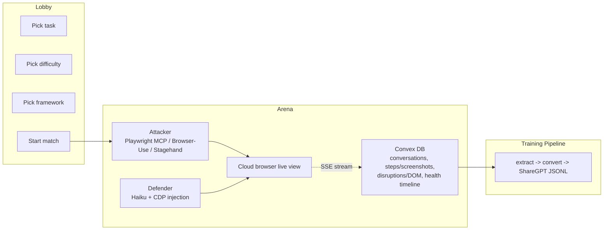

# Browser Brawl

**Train browser agents like GANs — by making them fight.**

One AI agent (the attacker) tries to complete a task on a real webpage. Another AI agent (the defender) tries to block it with JavaScript injections. They compete in real time inside a cloud browser. Every match produces rich, structured training data — tool calls, DOM snapshots, screenshots, full conversation traces — that you can use to fine-tune smaller browser models.

We've proven this works: traces from Browser Brawl fine-tune Qwen2.5-VL-3B into a capable browser agent.

> Built at the [Browser Use](https://browser-use.com) Web Agents Hackathon at [Y Combinator](https://events.ycombinator.com/browser-use-hackathon), San Francisco — Feb 28–Mar 1, 2026.

---

## The Idea: Adversarial Data Generation for Browser Agents

Browser agent training data is expensive. You either pay humans to label trajectories or you script narrow synthetic tasks. Both are slow, brittle, and boring.

We took inspiration from **Generative Adversarial Networks** (Goodfellow et al., 2014). In a GAN, a generator learns to produce realistic outputs by competing against a discriminator that tries to distinguish real from fake. The adversarial pressure forces both networks to improve — the generator produces increasingly realistic data, and the discriminator becomes a better judge.

Browser Brawl applies this intuition to browser agents:

| GAN | Browser Brawl |
|-----|---------------|
| **Generator** produces realistic data | **Attacker** navigates real websites, completes tasks |
| **Discriminator** tries to catch fakes | **Defender** disrupts the page with JS injections |
| Adversarial pressure improves both | Harder disruptions force richer, more resilient trajectories |
| Training signal from the competition | Training data from every match — win or lose |

The analogy isn't perfect — there's no shared gradient, no minimax objective, and the agents don't co-train in a single loop. But the core insight holds: **adversarial competition between agents produces richer, more diverse training data than either agent would generate alone.** The defender forces the attacker to recover from popups, hidden buttons, scroll hijacks, and DOM mutations — exactly the kind of edge cases that make browser agents robust.

The result: a scalable, configurable pipeline that turns a fun game into high-quality training data.

---

## How It Works



1. **Lobby** — Pick a task (Amazon shopping, Google Flights, Hacker News, etc.) and difficulty level
2. **Arena** — Both agents run concurrently. The attacker navigates the real website with Playwright. The defender injects JavaScript disruptions via CDP. Health drains over time and on each hit.
3. **Game Over** — Attacker wins by completing the task. Defender wins by depleting health to zero.
4. **Data** — Every match records full Claude conversations, tool calls, DOM snapshots, screenshots, and video to Convex for training data extraction.

---

## Features

### Game
- Real-time adversarial matches between two AI agents in a cloud browser
- 4 difficulty levels controlling defender aggression, health decay, and disruption pool
- 9 prebuilt JavaScript disruptions + AI-generated custom injections
- Live browser view embedded in the arena via iframe
- SSE streaming with full reconnection replay
- Turn-based mode for step-by-step analysis
- Cyberpunk neon UI with glitch animations, health bar shake, CRT scanlines

### History & Replay
- Paginated session list with difficulty/winner filters
- Step-by-step replay with full tool input/output, DOM snapshots, before/after screenshots
- Video player with play/pause, speed control (1x/2x/4x), scrubber
- CSV export for sessions and disruption effectiveness analysis

### Disruptions
| Disruption | Damage | What it does |
|-----------|--------|-------------|
| Session Expired Popup | 8 HP | Fullscreen fake "session expired" overlay |
| Fake Loading Spinner | 6 HP | Blocks viewport for 7 seconds |
| Button Camouflage | 8 HP | Makes all buttons invisible for 10 seconds |
| Scroll Hijack | 10 HP | Randomly scrolls the page for 6 seconds |
| Custom Injection (AI) | 15 HP | Haiku reads the DOM and generates targeted JS |
| Dialog Barrage | 12 HP | Three staggered confirmation dialogs |
| Element Obliterator | 20 HP | Removes submit buttons from the DOM |
| Visual Chaos | 15 HP | Shakes the entire page for 8 seconds |
| Coordinated Assault | 30 HP | Hides nav + redirect countdown + click blocker |

### Data Collection
- Full Claude conversation persistence (messages, tool calls, tool results — untruncated)
- Before/after screenshots via CDP on every step
- DOM snapshots (50 interactive elements with positions, IDs, classes)
- Health timeline with labeled deltas (decay vs. disruption damage)
- Network request logging (method, URL, status, size)
- Session video via CDP screencast (~1fps JPEG frames)
- Laminar auto-traces on all LLM calls

### Training Pipeline
- `extract-training-data.ts` — Pull successful game trajectories from Convex as raw JSONL
- `convert-to-sharegpt.ts` — Convert Anthropic tool format to Qwen2.5-compatible ShareGPT format
- Quality filters (minimum tool call count, success-only)
- Proven end-to-end: Convex → JSONL → ShareGPT → Qwen2.5-VL-3B fine-tuning (QLoRA via Axolotl)

---

## Tech Stack

| Layer | Technology |
|-------|-----------|
| **Frontend** | Next.js 16, React 19, TypeScript 5, Tailwind CSS 4 |
| **LLM** | Anthropic SDK — Claude Sonnet 4 (attacker), Claude Haiku 4.5 (defender) |
| **Cloud Browsers** | Browser-Use API (managed sessions with CDP + live view) |
| **Real-time Streaming** | Server-Sent Events (SSE) |
| **Database & Storage** | [Convex](https://convex.dev) (real-time DB + file storage) |
| **LLM Observability** | [Laminar](https://www.lmnr.ai) (auto-traces all Anthropic calls) |
| **Protocol** | [Model Context Protocol (MCP)](https://modelcontextprotocol.io) |
| **Fine-tuning Target** | Qwen2.5-VL-3B-Instruct (QLoRA via Axolotl + Unsloth) |
| **Testing** | Vitest |

### Supported Browser Agent Frameworks

The attacker agent is framework-agnostic — pick the one you prefer:

| Framework | How it works |
|-----------|-------------|
| [**Playwright MCP**](https://github.com/anthropics/mcp) | Spawns a Playwright MCP server connected to the cloud browser via CDP. Full tool suite (click, type, navigate, snapshot, etc.) |
| [**Browser-Use SDK**](https://browser-use.com) | Uses Browser-Use's built-in agent API for browser control |
| [**Stagehand**](https://github.com/browserbase/stagehand) | Browserbase's AI-native browser automation framework |

---

## Getting Started

### Prerequisites

- Node.js 20+
- npm

### Setup

```bash
# Install dependencies
npm install

# Set up environment variables
cp .env.local.example .env.local
# Fill in your API keys (see below)

# Start Convex (in a separate terminal)
npx convex dev

# Start the app
npm run dev
```

### Environment Variables

Create `.env.local` with:

```
ANTHROPIC_API_KEY=sk-ant-...
BROWSER_USE_API_KEY=bu_...
LMNR_PROJECT_API_KEY=...
NEXT_PUBLIC_CONVEX_URL=https://...convex.cloud
```

### Extract Training Data

```bash
# Pull successful game trajectories from Convex
npx tsx scripts/extract-training-data.ts --game <gameId> -o data/raw.jsonl

# Convert to ShareGPT format for Qwen2.5-VL fine-tuning
npx tsx scripts/convert-to-sharegpt.ts -i data/raw.jsonl -o data/train.jsonl
```

## API Routes

| Route | Method | Purpose |
|-------|--------|---------|
| `/api/game/start` | POST | Create browser session, start both agents |
| `/api/game/tasks` | GET | List available tasks |
| `/api/game/[sessionId]/events` | GET | SSE event stream (replays history on reconnect) |
| `/api/game/[sessionId]/status` | GET | Current game state snapshot |
| `/api/game/[sessionId]/abort` | POST | Stop game, clean up resources |
| `/api/export/sessions` | GET | CSV download of all sessions |
| `/api/export/disruptions` | GET | CSV download of all defender actions |

---

## Difficulty Levels

| Level | Defender Interval | Health Decay/s | Disruptions Available |
|-------|-------------------|----------------|----------------------|
| Easy | 20s | 0.05 | 2 |
| Medium | 10s | 0.2 | 5 |
| Hard | 5s | 0.4 | 7 |
| Nightmare | 2.5s | 0.8 | All 9 |

---

## Project Structure

```
src/
├── app/                          # Next.js pages + API routes
│   ├── api/game/                 # Game lifecycle endpoints
│   ├── api/export/               # CSV export endpoints
│   ├── history/                  # Replay UI (session list + detail viewer)
│   └── page.tsx                  # Main game page (lobby → arena → game over)
├── components/
│   ├── lobby/                    # Task selector, difficulty picker, fighter select
│   ├── arena/                    # Health bar, browser frame, agent panels
│   ├── end/                      # Winner banner
│   └── shared/                   # Glitch text, neon borders, loading screen
├── hooks/                        # useGameState, useGameSSE, useArenaTimer, useHealthBar
├── lib/
│   ├── attacker-playwright.ts    # Attacker: Playwright MCP + Claude Sonnet loop
│   ├── attacker-stagehand.ts     # Attacker: Stagehand alternative
│   ├── browser-use-attacker.ts   # Attacker: Browser-Use SDK alternative
│   ├── defender-agent.ts         # Defender: Haiku + JS injection loop
│   ├── disruptions.ts            # 9 prebuilt disruptions + cooldown system
│   ├── cdp.ts                    # CDP WebSocket: injectJS, snapshotDOM
│   ├── data-collector.ts         # Fire-and-forget Convex mutations
│   ├── screencast.ts             # CDP screencast frame capture
│   ├── sse-emitter.ts            # SSE broadcast to connected clients
│   └── game-session-store.ts     # In-memory session state
├── types/                        # TypeScript interfaces
convex/                           # Convex schema, mutations, queries
scripts/                          # Training data extraction + conversion
defender/                         # Standalone defender CLI (legacy prototype)
```

---

## Collaborators

- **Richard Hruby** — [GitHub](https://github.com/RichardHruby)
- **Mehul Gupta** — [GitHub](https://github.com/mehulgupta29)

---

## Acknowledgments

Built at the [Browser Use](https://browser-use.com) Web Agents Hackathon at [Y Combinator](https://events.ycombinator.com/browser-use-hackathon), San Francisco.

Sponsored by Anthropic, OpenAI, Vercel, Convex, and Browser Use.

Theoretical inspiration from: Goodfellow, I. J., et al. (2014). *Generative Adversarial Nets.* NeurIPS. [arXiv:1406.2661](https://arxiv.org/abs/1406.2661)
